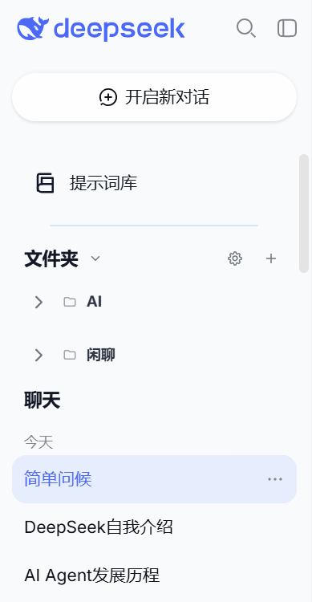
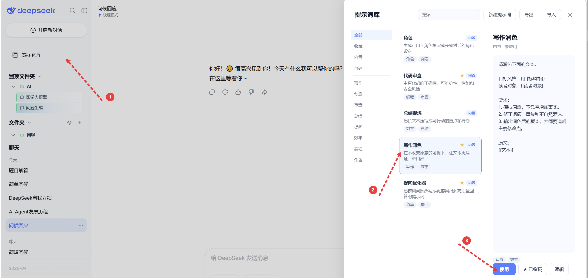
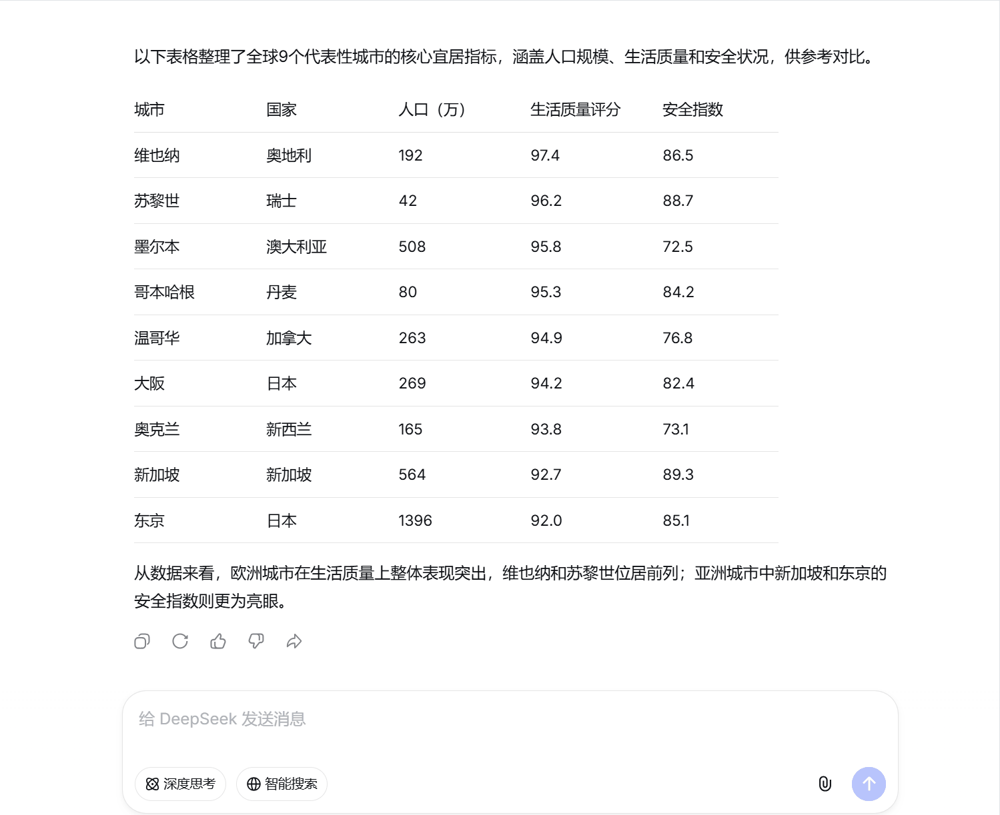
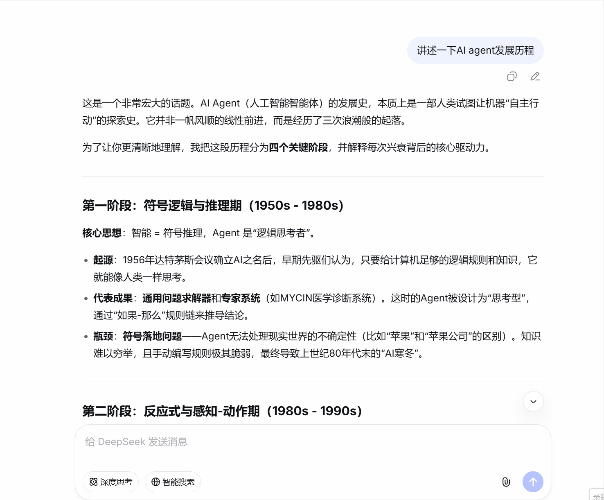

# Better DeepSeek

Better DeepSeek 是一个面向 [DeepSeek Chat](https://chat.deepseek.com/) 的本地优先浏览器扩展。

它把 DeepSeek 网页增强成一个更适合长期使用的 AI 工作台：你可以整理对话、沉淀提示词、引用回复、复制表格，并通过本地备份保留自己的工作流资产。

> 本地优先。不上传聊天记录。不做遥测。

## 功能概览

- **对话文件夹**：把 DeepSeek 对话整理到文件夹和子文件夹中，支持置顶常用文件夹和对话。
- **提示词库**：创建、收藏、打标签、搜索、导入、导出并复用提示词。
- **表格复制**：将 AI 生成的表格一键复制为 Markdown、CSV 或 JSON。
- **引用回复**：选中回复中的文本，带着上下文继续提问。
- **本地备份**：将文件夹数据导出或导入为 JSON。
- **Popup 入口**：启用/禁用扩展、打开/关闭文件夹和提示词库、重置 UI、复制诊断信息。
- **主题适配**：跟随 DeepSeek 的浅色和深色外观。
- **中英界面**：根据 DeepSeek 页面语言自动切换中文或英文。

## 功能展示

### 对话文件夹

把长期对话按项目、主题或任务整理到文件夹中，减少原生历史列表越用越乱的问题。



### 提示词库

把常用提示词沉淀成可搜索、可收藏、可分类的提示词库，需要时一键填入输入框。



### 表格复制

AI 回复中出现表格时，悬浮工具可以快速复制为 Markdown、CSV 或 JSON，适合继续写文档、做表格或交给其他工具处理。



### 引用回复

选中回复中的关键片段，直接作为上下文继续追问，避免手动复制粘贴长段内容。



## 隐私说明

Better DeepSeek 将数据保存在你的浏览器本地。

- 不包含统计分析。
- 不包含遥测。
- 不需要账号系统。
- 不包含追踪脚本。
- 不执行远程代码。
- 文件夹和提示词数据使用浏览器存储保存。
- 本扩展不会上传你的聊天内容。

扩展当前声明访问 `chat.deepseek.com` 以运行内容脚本功能，并声明访问 `www.deepseek.com` 以适配 DeepSeek 相关页面。

## 从源码安装

```bash
git clone https://github.com/fly233338/better-deepseek.git
cd better-deepseek
npm install
npm run build
```

然后手动加载扩展：

1. 打开 `chrome://extensions`。
2. 启用 **开发者模式**。
3. 点击 **加载已解压的扩展程序**。
4. 选择生成的 `dist` 文件夹。
5. 打开 `https://chat.deepseek.com/`。

## 开发

```bash
npm install
npm run typecheck
npm test
npm run build
```

项目结构：

```txt
src/
  content/   注入页面的 UI、功能模块、i18n 和主题适配
  core/      存储、文件夹/提示词状态、导入导出、运行时消息
  deepseek/  DeepSeek 页面相关 DOM 适配和输入框辅助逻辑
data/
  prompts/   内置提示词源数据
public/
  _locales/  浏览器扩展本地化元数据
assets/
  *.gif      README 和商店页展示素材
```

## 参与贡献

欢迎提交 issue 和 pull request。请使用 `.github/` 中的 GitHub 模板。

提交 pull request 前，请运行：

```bash
npm run typecheck
npm test
npm run build
```

如果是界面改动，请附上截图、GIF 或短视频，并检查浅色和深色主题。

## 项目状态

Better DeepSeek 仍处于早期开发阶段。DeepSeek 网页可能调整 DOM 结构，因此部分注入式 UI 行为后续可能需要适配。

如果页面 UI 出现异常，可以通过扩展 popup 作为恢复入口：临时禁用 Better DeepSeek、重置 UI，或复制诊断信息用于反馈。

## 许可证

MIT
